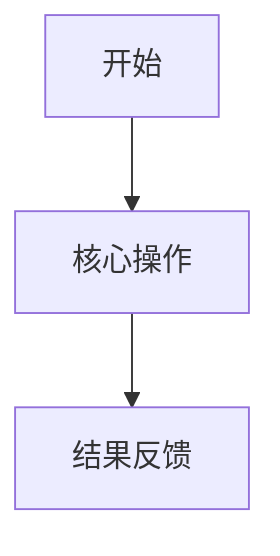

# 主策划案

> 当前状态：草稿  
> 主策划案是唯一事实源。程序版、UI 版、测试版和任务单版本必须基于本文件转译，不能改变本文件原意。

## 1. 文档信息

- 文档名称：
- 系统名称：
- 文档版本：
- 作者：
- 创建时间：
- 最后更新：

## 2. 背景与问题

### 2.1 背景

待填写。

### 2.2 当前问题

待填写。

### 2.3 第一版不做

- 待填写。

## 3. 设计目标

### 3.1 主要目标

待填写。

### 3.2 次要目标

待填写。

### 3.3 成功标准

| 编号 | 成功标准 | 判断方式 |
| --- | --- | --- |
|  |  |  |

## 4. 核心设计判断

| 判断点 | 已确认方案 | 放弃或暂缓方案 | 选择原因 | 风险 |
| --- | --- | --- | --- | --- |
|  |  |  |  |  |

## 5. 方案概述

待填写。

## 6. 玩家流程

### 6.1 主流程

### 6.2 分支流程

待填写。

## 7. 系统规则

### 7.1 参与条件

待填写。

### 7.2 核心规则

待填写。

### 7.3 刷新、重置与状态变化

待填写。

### 7.4 奖励、消耗或产出

待填写。

### 7.5 异常处理

待填写。

## 8. UI 与交互需求

| 页面/组件 | 状态 | 展示内容 | 可操作项 | 异常提示 |
| --- | --- | --- | --- | --- |
|  |  |  |  |  |

## 9. 表现与反馈需求

| 场景 | 表现目标 | 反馈形式 | 优先级 |
| --- | --- | --- | --- |
|  |  |  |  |

## 10. 数值与配置需求

| 配置项 | 类型 | 默认值 | 是否可调整 | 备注 |
| --- | --- | --- | --- | --- |
|  |  |  |  |  |

## 11. 异常、边界与兼容情况

| 场景 | 处理规则 | UI 反馈 | 测试重点 |
| --- | --- | --- | --- |
|  |  |  |  |

## 12. 需求拆解

| 岗位 | 需求内容 | 优先级 | 依赖 | 验收方式 |
| --- | --- | --- | --- | --- |
| 程序 |  |  |  |  |
| UI |  |  |  |  |
| 数值 |  |  |  |  |
| 测试 |  |  |  |  |
| 美术/表现 |  |  |  |  |

## 13. 风险评估与取舍说明

| 风险 | 影响 | 当前应对 | 状态 |
| --- | --- | --- | --- |
|  |  |  |  |

## 14. 验收标准

| 编号 | 验收项 | 前置条件 | 操作 | 预期结果 |
| --- | --- | --- | --- | --- |
| AC-001 |  |  |  |  |

## 15. 待确认问题与后续迭代

### 15.1 开发前必须确认

| 编号 | 问题 | 影响范围 | 当前建议 | 状态 |
| --- | --- | --- | --- | --- |
|  |  |  |  |  |

### 15.2 开发中可确认

| 编号 | 问题 | 影响范围 | 当前建议 | 状态 |
| --- | --- | --- | --- | --- |
|  |  |  |  |  |

### 15.3 后续迭代

- 待填写。

