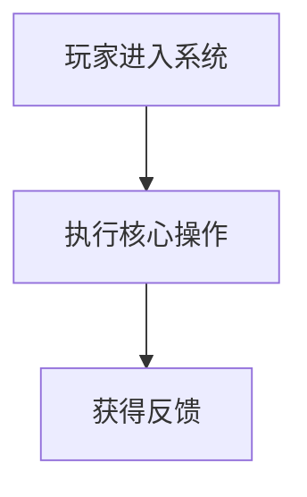

# 主策划案模板

> 主策划案是唯一事实源。岗位转译版必须基于本文件，不能改变本文件原意。

## 1. 文档信息

- 文档名称：
- 系统名称：
- 文档版本：
- 创建时间：
- 最后更新：
- 作者：
- 当前状态：草稿 / 待评审 / 已确认 / 已废弃

## 2. 背景与问题

### 2.1 背景

说明该系统出现的项目背景。

### 2.2 当前问题

说明当前项目或玩家体验中存在什么问题。

### 2.3 不做范围

明确本策划案不解决哪些问题，避免范围扩散。

## 3. 设计目标

### 3.1 主要目标

说明系统最核心目标。

### 3.2 次要目标

说明附带目标。

### 3.3 成功标准

说明如何判断设计达成目标。

## 4. 核心设计判断

记录关键取舍。

| 判断点 | 选择方案 | 放弃方案 | 选择原因 | 风险 |
| --- | --- | --- | --- | --- |
|  |  |  |  |  |

## 5. 方案概述

用较短篇幅说明系统整体方案。

## 6. 玩家流程

### 6.1 主流程

### 6.2 分支流程

说明特殊路径、失败路径、未解锁路径等。

## 7. 系统规则

### 7.1 参与条件

- 条件：
- 判断时机：
- 不满足时反馈：

### 7.2 核心规则

- 触发条件：
- 执行逻辑：
- 结果：
- 状态变化：
- 边界：

### 7.3 刷新与重置

- 刷新时间：
- 重置范围：
- 未完成内容处理：

### 7.4 奖励与消耗

- 奖励类型：
- 发放时机：
- 消耗类型：
- 异常处理：

## 8. UI 与交互需求

| 页面/组件 | 状态 | 展示内容 | 可操作项 | 异常提示 |
| --- | --- | --- | --- | --- |
|  |  |  |  |  |

## 9. 表现与反馈需求

| 触发场景 | 表现目标 | 反馈形式 | 优先级 | 备注 |
| --- | --- | --- | --- | --- |
|  |  |  |  |  |

## 10. 数值与配置需求

| 配置项 | 类型 | 默认值 | 是否可运营调整 | 备注 |
| --- | --- | --- | --- | --- |
|  |  |  |  |  |

## 11. 异常、边界与兼容情况

| 场景 | 处理规则 | UI反馈 | 是否需测试 |
| --- | --- | --- | --- |
| 断线 |  |  | 是 |
| 跨天 |  |  | 是 |
| 奖励发放失败 |  |  | 是 |
| 重复点击 |  |  | 是 |

## 12. 需求拆解

| 岗位 | 需求内容 | 优先级 | 依赖 | 验收方式 |
| --- | --- | --- | --- | --- |
| 程序 |  |  |  |  |
| UI |  |  |  |  |
| 美术 |  |  |  |  |
| 数值 |  |  |  |  |
| 测试 |  |  |  |  |

## 13. 风险评估与取舍说明

| 风险 | 影响 | 发生概率 | 应对方案 | 是否可接受 |
| --- | --- | --- | --- | --- |
|  |  |  |  |  |

## 14. 验收标准

| 编号 | 验收项 | 前置条件 | 操作 | 预期结果 |
| --- | --- | --- | --- | --- |
| AC-001 |  |  |  |  |

## 15. 待确认问题与后续迭代

| 编号 | 问题 | 影响范围 | 当前建议 | 状态 |
| --- | --- | --- | --- | --- |
|  |  |  |  |  |
